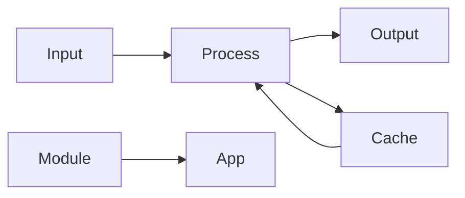

# ESPsomo
Small to Medium Automation Solutions: From Hobby to Lifestyle with IoT

[](https://github.com/espsomo/project/releases)
[](https://codecov.io/gh/espsomo/project)
[](LICENSE)
[](CONTRIBUTING.md)

> A powerful solution for [solve this problem] that helps developers [achieve this goal]

[](https://t.me/ESPsomo)

<p align="center">
  
</p>
font-size: 40px;
<p align="center">
  My README
</p>


<details>
  <summary>Click to reveal the secret message</summary>
  The secret message is: GitHub is awesome!
  <details>
  <summary>Click to reveal the secret message</summary>
  The secret message is: GitHub is awesome!
    <details>
  <summary>Click to reveal the secret message</summary>
  The secret message is: GitHub is awesome!
</details>
</details>
</details>

## ✨ Features

- 🎯 **Feature One** - Brief description of what it does and why it matters
- 🔥 **Feature Two** - Another killer feature that sets your project apart
- 🎨 **Feature Three** - Something else amazing about your project


## 📋 Table of Contents

- [Installation](#installation)
- [Quick Start](#quick-start)
- [Documentation](#documentation)
- [Examples](#examples)
- [Architecture](#architecture)
- [Contributing](#contributing)
- [License](#license)

## 🚀 Installation

```bash
# Using npm
npm install project-name

# Using yarn
yarn add project-name

# Using pnpm
pnpm add project-name
```

## 🏃 Quick Start

```javascript
import { ProjectName } from 'project-name';

// Basic usage
const instance = new ProjectName({
  option1: 'value1',
  option2: 'value2'
});

// Do something amazing
instance.doSomething();
```

## 📖 Documentation

### Core Concepts

Here's a simple flowchart of how the project works:



### API Reference

#### `method1(param1, param2)`

Description of what this method does.

```javascript
// Example usage
const result = instance.method1('foo', 'bar');
```

| Parameter | Type     | Description                |
|-----------|----------|----------------------------|
| `param1`  | `string` | Description of parameter 1 |
| `param2`  | `string` | Description of parameter 2 |

## 🎯 Examples

### Basic Example

```javascript
// Show a simple example
const basic = new ProjectName();
basic.simpleOperation();
```

### Advanced Example

```javascript
// Show a more complex example
const advanced = new ProjectName({
  feature: 'advanced',
  mode: 'pro'
});
advanced.complexOperation();
```

## 🏗 Architecture

<p align="center">
  
</p>

The project follows a modular architecture with these key components:

- **Core Module**: Handles central logic
- **API Layer**: Manages external communications
- **Data Layer**: Handles data persistence
- **UI Components**: User interface elements

## 🤝 Contributing

We love your input! Check out our [Contributing Guidelines](CONTRIBUTING.md) to get started.

### Development Setup

```bash
# Clone the repository
git clone https://github.com/username/project.git

# Install dependencies
npm install

# Run tests
npm test
```

### Code Style

We use ESLint and Prettier to maintain code quality. Please ensure your code follows our style guide:

```bash
# Check code style
npm run lint

# Fix code style issues
npm run lint:fix
```

## 📈 Performance

Here's how our project performs in key metrics:

| Metric           | Score  | Industry Average |
|------------------|--------|------------------|
| Load Time        | 1.2s   | 2.4s            |
| Memory Usage     | 45MB   | 78MB            |
| API Response     | 100ms  | 250ms           |

## 📄 License

This project is licensed under the MIT License - see the [LICENSE](LICENSE) file for details.

## 🙏 Acknowledgments

- Thanks to all contributors who have helped this project grow
- Special thanks to [Library/Tool 1] for inspiration
- Shoutout to our amazing community

---

<p align="center">Made with ❤️ by <a href="https://github.com/username">Your Name</a></p>
